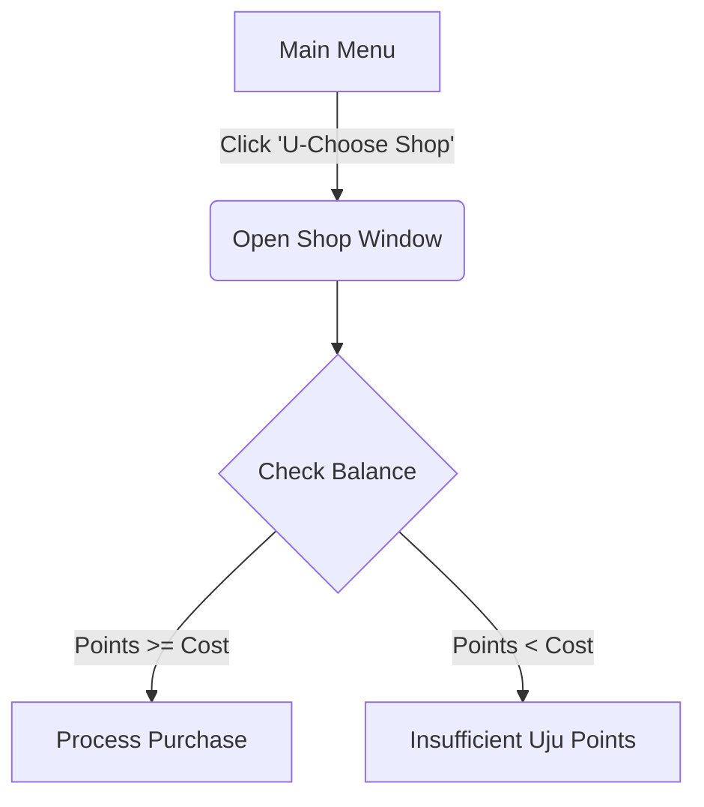

# System Architecture & Data Design

## Graphical User Interface (GUI) Flows
The interface uses CustomTkinter widgets organised reactively. Below is the layout state transition map for the Shop transaction flow:

### U-Choose Shop

# Data Dictionary & Storage Layout

## Player JSON Database File (`game_management/players.json`)

The application implements a flat-file array of objects tracking current user states

| Field Name | Data Type | Validation Constraints | Contextual Description |
| :--- | :--- | :--- | :--- |
| `player_id` | `String` | Unique primary key| Unique identification string |
| `name` | `String` | Minimum length 1, maximum length 12 characters | Player profile display name|
| `points` | `Integer` | Min value `0`, maximum value `999999` | Cumulative points used as purchase currency |
| `wins` | `Integer` | Min value `0`, incremented by 1 | Total game matches won |
| `games` | `Integer` | Min value `0`, constraint: `games >= wins` | Cumulative game count history |
| `rank` | `Integer` | Assigned dynamically via array sort operations | Relative placement on the global scoreboard |
| `reward` | `String` | Matches active catalogue keys or evaluates to `"None"` | Item rewarded via high-rank achievement tracking |
| `inventory` | `Array` | Contains text strings mapping to active shop keys | Collection of items unlocked by the profile |
