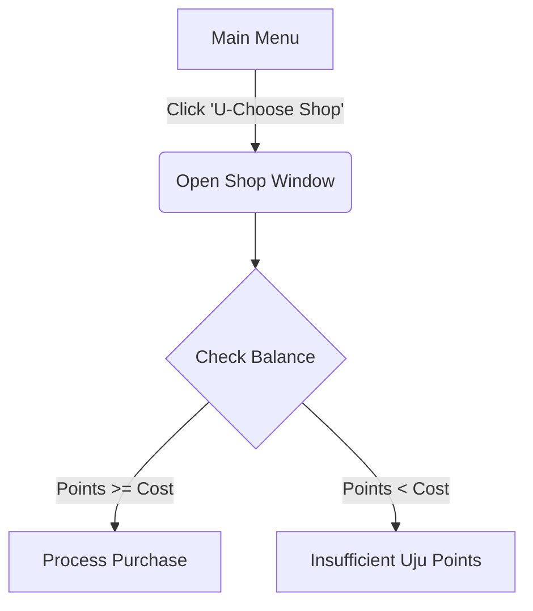

## U-Choose Shop Design
The shop interface utilises a centralised `ctk.CTkFrame` structure. At the top, a prominent balance banner displays the active player's profile ID and their live wallet balance. Individual inventory items are rendered dynamically inside separate horizontal row frames (`fill="x"`). Each row showcases the item title, a categorised utility badge, a brief descriptive text string, and an aligned checkout button. Below is a flowchart of the shop's navigation.

## Leaderboard Design
The leaderboard UI presents an arcade-style standings dashboard. The interface reads local JSON entry collections and populates a vertical stack of rank labels. The Top 3 ranking podium rows feature bold typography treatments and custom hex colour codes (#FFD700, #C0C0C0, #CD7F32) to establish a clear visual hierarchy.
