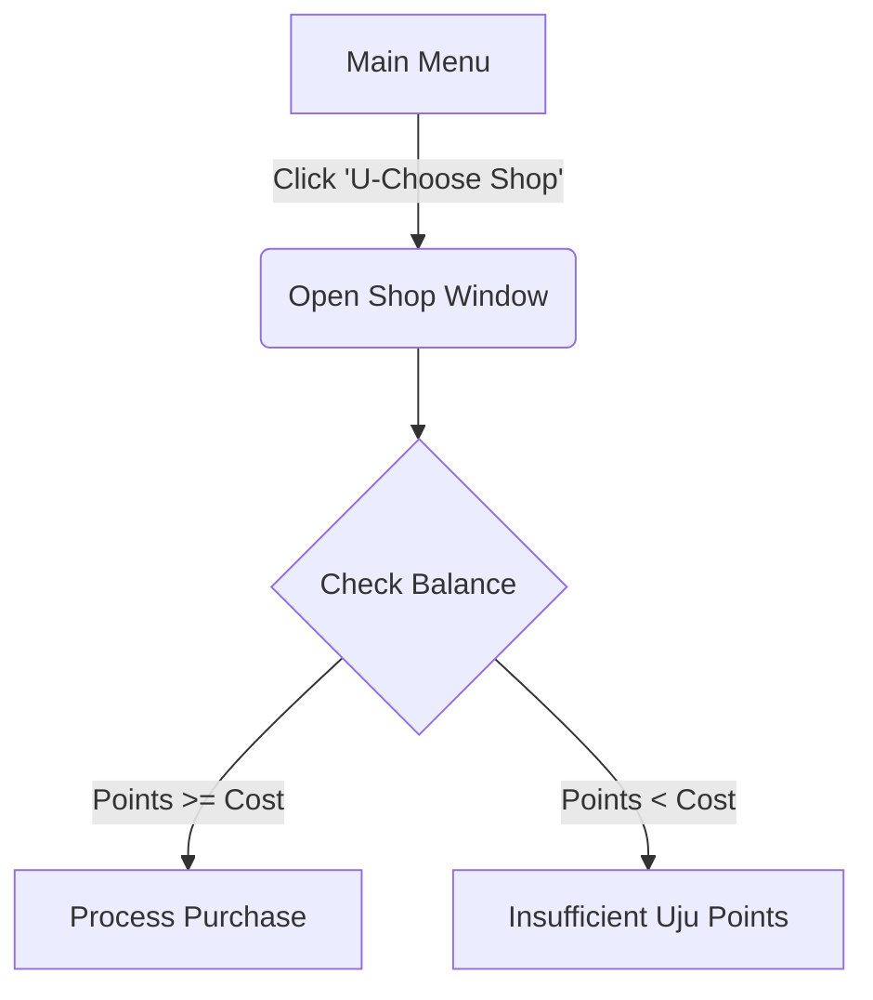
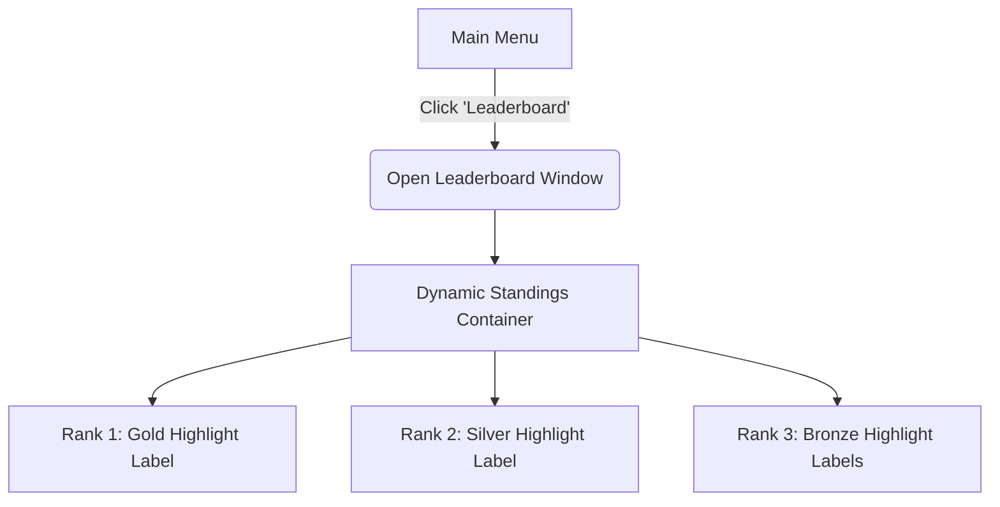

# GUI Design and 
## U-Choose Shop Design
The shop interface utilises a centralised `ctk.CTkFrame` structure. At the top, a prominent balance banner displays the active player's profile ID and their live wallet balance. Individual inventory items are rendered dynamically inside separate horizontal row frames (`fill="x"`). Each row showcases the item title, a categorised utility badge, a brief descriptive text string, and an aligned checkout button. Below is a flowchart of the shop's navigation.

### U-Choose Shop GUI Design
The interface is structured in a panel-based layout, consisting of three main sections:
* Player Information Panel: Displays the current player's ID and available points. 
* This is dynamically updated whenever a purchase is made, ensuring real-time feedback.
* Item Display Panel: Presents a list or grid of purchasable items. Each item includes:
  * name
  * cost
  * description (e.g. "Card Counter: tracks played cards in Daifugo")
  * Interaction Controls
* Includes buttons such as "Buy" and "Back", allowing the user to purchase items or return to the main menu.
---
* Tkinter will be used as the core GUI framework, responsible for creating the main application window, handling user input events, and managing widgets such as labels, buttons, and frames. 
  * For example, the shop screen will be constructed using Tkinter frames to separate different sections of the interface, including the player information panel, item display area, and navigation controls. 
  * Labels will display dynamic data such as the player's current points, while buttons will allow the user to purchase items or return to the main menu.

* CustomTkinter extends Tkinter by providing modern styling and enhanced widgets, allowing the shop interface to be more visually appealing and user-friendly. 
  * This is particularly useful for implementing features such as themed buttons, rounded panels, and colour schemes that can reflect purchased aesthetic items (e.g. a gold theme).
  * As a result, CustomTkinter improves the overall user experience without requiring complex graphical programming.
---
The shop GUI is directly controlled by the MainWindow class, which manages navigation through the current_screen variable. When the user selects the shop option from the main menu, the main window updates this variable to "shop" and renders the corresponding GUI components.

Tkinter event handling is used to connect user actions to program logic. For example:
* Clicking a "Buy" button triggers a function
* This function calls methods from the Player class
* The result (success or failure) is then reflected in the GUI

This demonstrates how Tkinter acts as the interface layer, while the MainWindow acts as the control layer, coordinating interactions between the GUI and underlying data structures.

When the shop GUI is displayed:
* The player's points are retrieved using player_id
* Displayed using a Tkinter label
* Updated dynamically after purchases
---
The reason I used of Tkinter and CustomTkinter is because:
* Separation of concerns
* GUI handles display
* Classes handle logic
* ERD defines structure
* Event-driven programming
* Efficient handling of user interactions
* Scalability
* New shop items or features can be added easily
* Consistency with OOP design
* GUI interacts with objects rather than raw data

Compared to alternatives such as Pygame, Tkinter is more suitable for this component because it provides built-in GUI elements like buttons and labels, which are essential for menu-based systems like the shop.

---
Overall, Tkinter and CustomTkinter provide the necessary tools to implement a responsive and visually appealing shop GUI. Their integration with the MainWindow class ensures smooth navigation, while their interaction with the Player entity and shop data structures demonstrates a clear link to the ERD. This layered approach (GUI → control → data) results in a well-structured, maintainable, and scalable system.
The GUI retrieves player data from the leaderboard structure and item data from a predefined dictionary. When a purchase is attempted, the system validates whether the player has sufficient points. If valid, the transaction is processed, updating both the player’s points and their owned items

## Leaderboard Design
The leaderboard UI presents an arcade-style standings dashboard. The interface reads local JSON entry collections and populates a vertical stack of rank labels. The Top 3 ranking podium rows feature bold typography treatments and custom hex colour codes (#FFD700, #C0C0C0, #CD7F32) to establish a clear visual hierarchy. 
* This allows users to quickly identify their position within the rankings without scanning the entire table. 
* Spacing and alignment are carefully managed to ensure readability, particularly when displaying multiple players.
* Allows for visually impared users to clearly see rankings in an easy way.

The leaderboard GUI is designed to present player rankings in a clear, interactive, and visually structured format. Its primary purpose is to display player performance data, including points accumulated across all games, while also allowing users to easily interpret rankings and track progression over time.

* The layout of the leaderboard is based on a tabular structure, where each row represents an individual player and each column displays a specific attribute. 
* Key fields include the player's username or ID, total points, number of games played, and number of wins. 
* The table is organised in descending order of points, ensuring that the highest-ranking players are displayed at the top. 
* This sorting is performed dynamically before rendering, ensuring that the displayed data always reflects the most recent updates stored in the system.
* The GUI includes a title header, clearly labelling the screen as the leaderboard, along with navigation controls such as a "Back" button that allows the user to return to the main menu. 
* This button interacts with the `screen_history` structure defined in the main window, reinforcing consistency in navigation design across the application.
* The design also supports real-time updates, meaning that after a game is completed, any changes to player points are immediately reflected when the leaderboard is accessed. This ensures consistency between gameplay outcomes and displayed rankings, improving the overall responsiveness of the system.
* In terms of scalability, the GUI is designed to handle varying numbers of players. If the number of entries exceeds the visible space, a scrolling mechanism can be implemented to allow users to navigate through the full list. This ensures that the interface remains functional regardless of the size of the dataset.

---
Overall, the leaderboard GUI combines structured data presentation with interactive elements to create an intuitive and efficient user experience. Its design aligns closely with the underlying data structures and control systems of the application, ensuring that data is accurately retrieved, processed, and displayed. This contributes to both the usability and reliability of the Ippan system, making it easier for users to engage with and understand their progress within the game.
